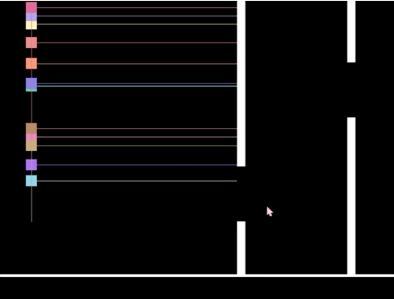
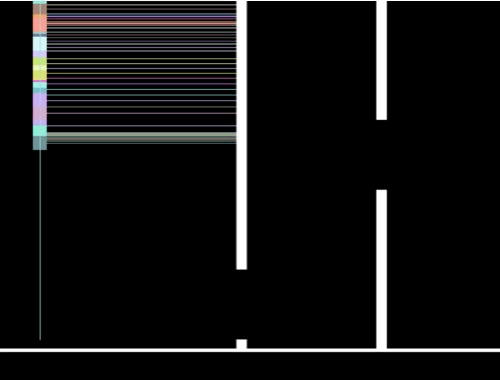

# FlappyBird

This flappy brid version is created using NEFT, or a neuro evolution of fixed topologies, which is basically a genetic algorithm that only adjusts the weights of nodes in the neural network. We are using a perceptron neural network and a natural selection process to improve the accuracy of the neural network. 

## Game Demos

